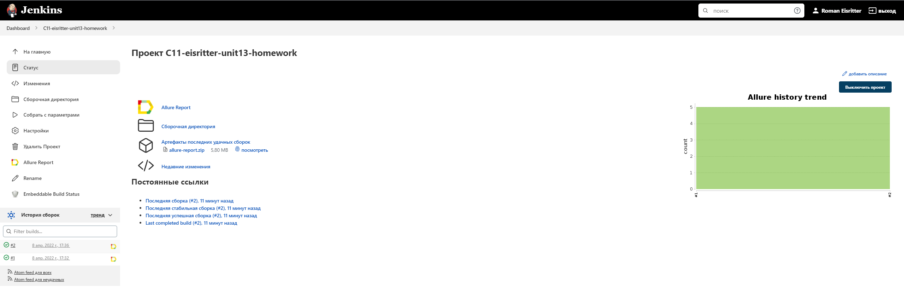
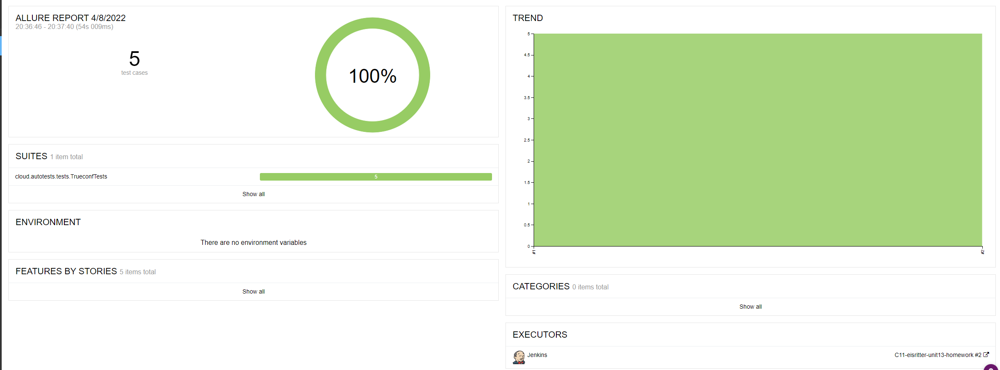
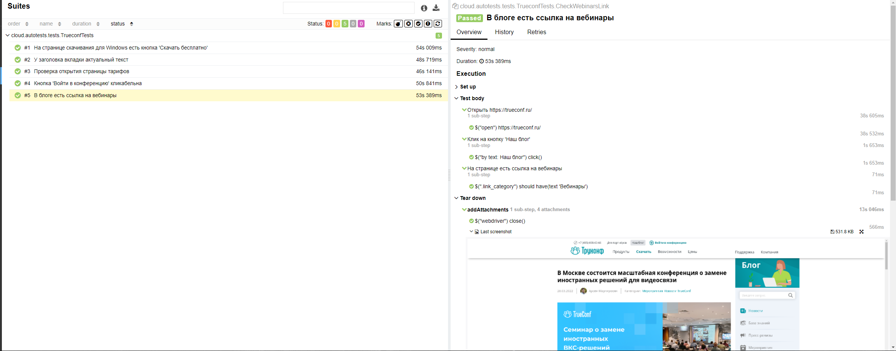
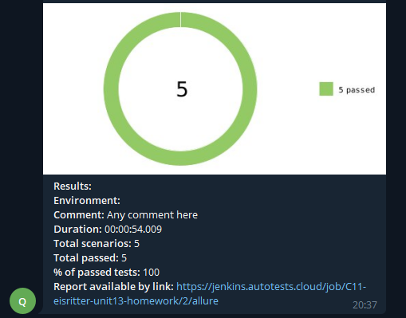

# Проект по автоматизации тестирования для <a target="_blank" href="https://trueconf.ru/">Trueconf</a>

## 📃 Содержание:

- [Технологии и инструменты](#earth_africa-технологии-и-инструменты)
- [Реализованные проверки](#earth_africa-Реализованные-проверки)
- [Сборка в Jenkins](#earth_africa-Jenkins-job)
- [Запуск из терминала](#earth_africa-Запуск-тестов-из-терминала)
- [Allure отчет](#earth_africa-Allure-отчет)
- [Отчет в Telegram](#earth_africa-Уведомление-в-Telegram-при-помощи-бота)
- [Видео примеры прохождения тестов](#earth_africa-Примеры-видео-о-прохождении-тестов)

## :computer: Технологии и инструменты
<p align="center">


</p>

## :boom: Реализованные проверки

- ✓ На странице скачивания для Windows есть кнопка 'Скачать бесплатно'
- ✓ У заголовка вкладки верный текст
- ✓ Страница тарифов TrueConf Online открывается
- ✓ Кнопка 'Войти в конференцию' кликабельна
- ✓ На странице блога есть ссылка на вебинары

## </a> Jenkins job
<a target="_blank" href="https://jenkins.autotests.cloud/job/C11-eisritter-unit13-homework//">Сборка в Jenkins</a>
<p align="center">
<a href="https://jenkins.autotests.cloud/job/C11-eisritter-unit13-homework//"></a>
</p>

### :maple_leaf: Параметры сборки в Jenkins:

- browser (браузер, по умолчанию chrome)
- browserSize (размер окна браузера, по умолчанию 1920x1080)
- remoteDriverUrl (логин, пароль и адрес удаленного сервера selenoid или grid)
- threads (количество потоков)
- AlureNotificationVersion (версия AllureNotification)

## :computer: Запуск тестов из терминала

Локальный запуск:
```
gradle clean test
```

Удаленный запуск:
```
clean
test
-Dbrowser=${BROWSER}
-DbrowserSize=${BROWSER_SIZE}
-DremoteDriverUrl=https://user1:1234@${REMOTE_DRIVER_URL}/wd/hub/
-DvideoStorage=https://${REMOTE_DRIVER_URL}/video/
-Dthreads=${THREADS}
```
## </a> Отчет в <a target="_blank" href="https://jenkins.autotests.cloud/job/C11-eisritter-unit13-homework/allure">Allure report</a>

### :lady_beetle: Основное окно

<p align="center">

</p>

### :cherries: Тесты

<p align="center">

</p>

## </a> Уведомление в Telegram при помощи бота

<p align="center">

</p>


## </a> Видео прохождения теста

<p align="center">
 
</p>
